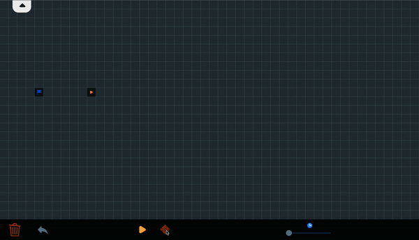

## Algorithm visualization with Flutter & Dart 

This project aims to visualize different algorithms using Flutter in & Dart. Starting from path finding algorithms, but wishing to go further to arrays, trees, graphs... 

  

- :white_check_mark: Add time control, to increase/decrease time step
- :white_check_mark: Enable/disable diagonal nodes
- :white_check_mark: DFS/BFS
- :white_square_button: Ability to move the end/start node and see the change
- :white_square_button: Impmenent sorting of nodes with heap rather then sorting a list for Dijkstra/A*
- :white_check_mark: Maze generator

